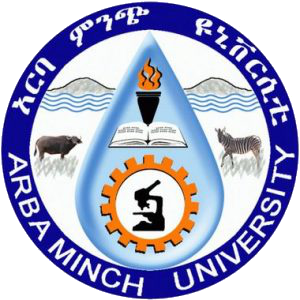

<!---
ocots/ocots is a ✨ special ✨ repository because its `README.md` (this file) appears on your GitHub profile.
You can click the Preview link to take a look at your changes.
--->

&nbsp;&nbsp;&nbsp;&nbsp;&nbsp;&nbsp;

&nbsp;&nbsp;&nbsp;&nbsp;&nbsp;&nbsp;

Associate professor of applied mathematics at
<a href="http://www.irit.fr/">IRIT (UMR CNRS 5505)</a>, 
<a href="http://www.enseeiht.fr/fr">ENSEEIHT (D&eacute;pt. SN)</a>.

Scientific interests: Optimal control: Geometry, algorithms and applications.

Team <a href="http://apo.enseeiht.fr/">Algo. Parall&egrave;les et Optimisation</a>.

## Contact and profile

<a href="mailto:olivier.cots@toulouse-inp.fr">
&nbsp;&nbsp;&nbsp;&nbsp;&nbsp;&nbsp;

 &nbsp;&nbsp;&nbsp;&nbsp;&nbsp;&nbsp;
 

## Publications

&nbsp;&nbsp;&nbsp;&nbsp;&nbsp;&nbsp;
 &nbsp;&nbsp;&nbsp;&nbsp;&nbsp;&nbsp;

## Softwares

[control-toolbox](https://github.com/control-toolbox): A julia ecosystem of packages to solve optimal control problems. Since 2023.

[hampath](http://hampath.org): A Fortran code with a Python interface to solve optimal control problems by indirect and path following methods. Since 2009.

[nutopy](https://ct.gitlabpages.inria.fr/nutopy/): NUmerical TOolbox in PYthon (nutopy) to solve optimal control problems. See the [gallery](http://control-toolbox.inria.fr) of examples. Since 2019.

&nbsp;&nbsp;&nbsp;&nbsp;&nbsp;&nbsp;

## Teaching

 [ENSEEIHT](https://gitlab.irit.fr/toc/etu-n7)

 [CIMPA](https://gitlab.irit.fr/toc/cimpa/gnmoc)
