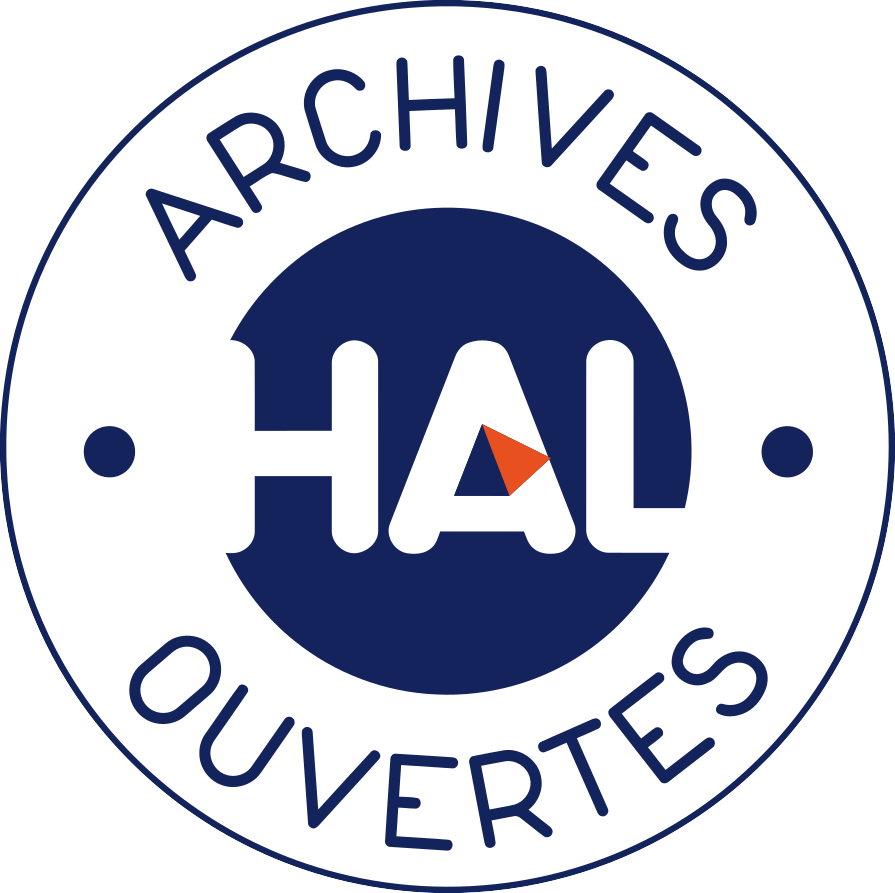

<!---
ocots/ocots is a ✨ special ✨ repository because its `README.md` (this file) appears on your GitHub profile.
You can click the Preview link to take a look at your changes.
--->

Associate professor of applied mathematics at
<a href="http://www.irit.fr/">IRIT (UMR CNRS 5505)</a>, 
<a href="http://www.enseeiht.fr/fr">ENSEEIHT (D&eacute;pt. SN)</a>.

Scientific interests: Optimal control: Geometry, algorithms and applications.

Team <a href="http://apo.enseeiht.fr/">Algo. Parall&egrave;les et Optimisation</a>,
member of
<a href="http://smai.emath.fr/spip.php?article330&lang=fr">SMAI-MODE</a>,
<a href="https://perso.math.univ-toulouse.fr/spot/">SPOT</a>.

## Contact and profile

&nbsp;&nbsp;&nbsp;&nbsp;&nbsp;&nbsp;
<a href="mailto:olivier.cots@toulouse-inp.fr">
&nbsp;&nbsp;&nbsp;&nbsp;&nbsp;&nbsp;

 &nbsp;&nbsp;&nbsp;&nbsp;&nbsp;&nbsp;
 
## Publications

&nbsp;&nbsp;&nbsp;&nbsp;&nbsp;&nbsp;
 &nbsp;&nbsp;&nbsp;&nbsp;&nbsp;&nbsp;

